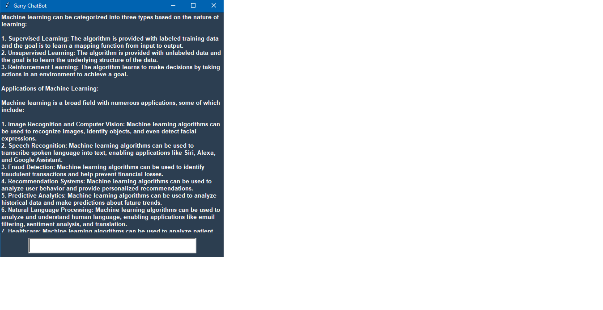

# GARRY AI CHATBOT MODEL

## Imports:

tkinter and its submodules for creating the GUI elements.
PIL for handling images (used for the splash screen).
langchain-huggingface to connect to the LLM hosted on Hugging Face Hub.

## API Key and Repository Setup:

sec_key: Replace this with your own Hugging Face Hub API key.
repo_id: This specifies the LLM repository ID on Hugging Face. Update this if you're using a different model.
llm: This object handles communication with the LLM.

## GUI Functions:

show_main_window: This function creates the main window and handles user interaction.
send_message: This function is called when the user presses Enter or types "exit".
It retrieves the user's message, capitalizes it, and updates the conversation display.
If the message is "exit", it closes the window.
Otherwise, it sends the message to the LLM using llm.invoke and updates the conversation display with the model's response.
caps: This function capitalizes the text in the input field on every key release (optional, can be removed).

## GUI Elements:

#### Splash Screen:

A splash screen displays for a few seconds before the main window appears.
It uses a GIF image

#### Main Window:

A text box displays the conversation history with clear formatting for user and bot messages.
A styled input field allows users to type their messages.
Clicking in the input field clears any placeholder text.
Pressing Enter sends the message and focuses back on the input field.

## Running the Script:

Make sure you have the required libraries installed (tkinter, PIL, langchain-huggingface).
Replace the placeholder values with your own:
sec_key: Your Hugging Face Hub API key.
repo_id: The ID of the LLM repository you want to use.
gif_image (optional): The path to your splash screen GIF.
Run the script. The splash screen will display for a few seconds, followed by the main window where you can interact with the LLM.

## Screen-Shots of the project

## Note:

This code provides a basic framework. You can customize it further by adding features like saving conversation history, changing font styles, implementing different functionalities for specific user inputs, etc.
